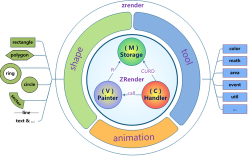

#   可视化技术01-canvas

## 1.可视化基础知识介绍
###   svg
 SVG 是一种使用 XML 描述 2D 图形的语言。
 可缩放矢量图形(Scalable Vector Graphics）,XML 来描述二维图形和绘图程序的语言。SVG 基于 XML，这意味着 SVG DOM 中的每个元素都是可用的。您可以为某个元素附加 JavaScript 事件处理器。
在 SVG 中，每个被绘制的图形均被视为对象。如果 SVG 对象的属性发生变化，那么浏览器能够自动重现图形。

- 不依赖分辨率
- 支持事件处理器
- 最适合带有大型渲染区域的应用程序（比如谷歌地图）
- 复杂度高会减慢渲染速度（任何过度使用 DOM 的应用都不快）
- 不适合游戏应用

###   canvas
Canvas 通过 JavaScript 来绘制 2D 图形。
是逐像素进行渲染的。一旦图形被绘制完成，它就不会继续得到浏览器的关注。如果其位置发生变化，那么整个场景也需要重新绘制，包括任何或许已被图形覆盖的对象。

- 依赖分辨率
- 不支持事件处理器
- 弱的文本渲染能力
- 能够以 .png 或 .jpg 格式保存结果图像
- 最适合图像密集型的游戏，其中的许多对象会被频繁重绘

### webgl
WebGL（全写Web Graphics Library）是一种3D绘图标准，这种绘图技术标准允许把JavaScript和OpenGL ES 2.0结合在一起，通过增加OpenGL ES 2.0的一个JavaScript绑定，WebGL可以为HTML5 Canvas提供硬件3D加速渲染，这样Web开发人员就可以借助系统显卡来在浏览器里更流畅地展示3D场景和模型了，还能创建复杂的导航和数据视觉化。
- canvas 3D

## 2.canvas
1.[canvas原生](http://zhu18.cn/group/users/zhurunya/)

2.[canvas案例-01图表](http://echarts.baidu.com/)

3.[canvas案例-02特效](https://www.html5tricks.com/demo/html5-canvas-beam-explosion/index2.html)

4.[canvas案例-03特效](https://www.html5tricks.com/demo/html5-canvas-dream-tree/index.html)

canvas库：Kinetic.JS,pixijs,EaselJS,Paper.js,Processing.js
zrender.js,p5.js...

## [3.zrender.js](https://ecomfe.github.io/zrender-doc/public/)
是一个轻量级高性能的Canvas类库，更加符合国人的习惯

-  解决cavnas，svg，vml 浏览器兼容
-  降低canvas编写门槛
-  提高canvas编码效率

API文档基础介绍

实际动手操作

## [4.p5.js](https://p5js.org/zh-Hans/)
P5是Processing语言的一个JS移植版本，使其能在Web中工作。它完全使用JavaScript来实现Processing语言相同的功能，但并不会动态翻译Processing语言代码，这一点和Processing.js不同。也就是P5.js差不多等同于Processing.js的JS API部分。但P5.js的功能更单一，角色更专注

什么是Processing

Processing是关于数字艺术的编程语言，支持跨平台，语言本身是一个类Java语言，程序文件的后缀为.pde。
什么是Processing.js
为了能让Processing的代码能在Web上工作，John Resig开发了Processing.js（这是继Jquery之后，他的第二个力作）

[视频介绍](hello.p5js.org)

[特效演示01](http://www.jq22.com/code1630)

[特效演示02](https://www.vantajs.com/?effect=topology)

[特效演示03](https://zhu18.github.io/TAV/00003_P5_FIREWORKS/)

[编辑器](https://editor.p5js.org/zhu18/sketches/B1dsW3pom)
-   基础类库
-   processing语法
-   代码简单
-   炫酷的效果

